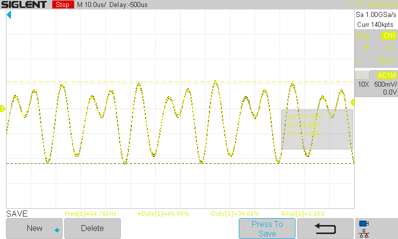
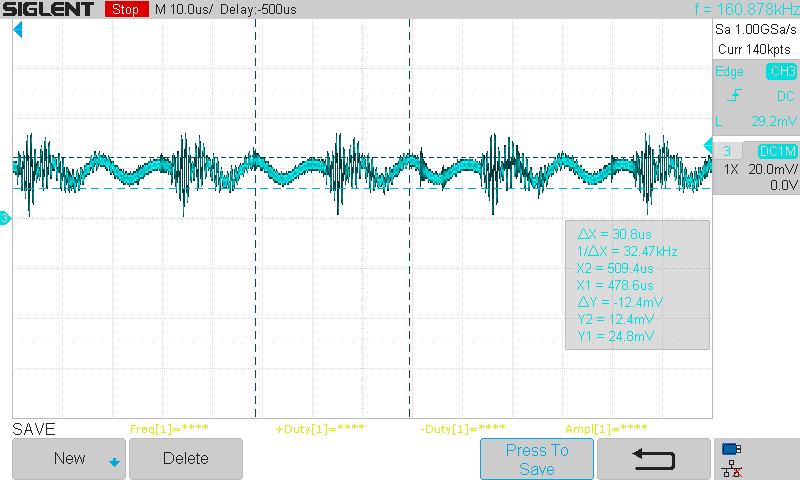
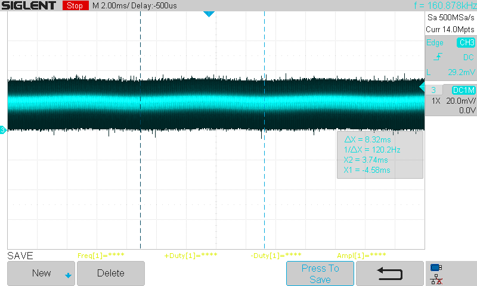
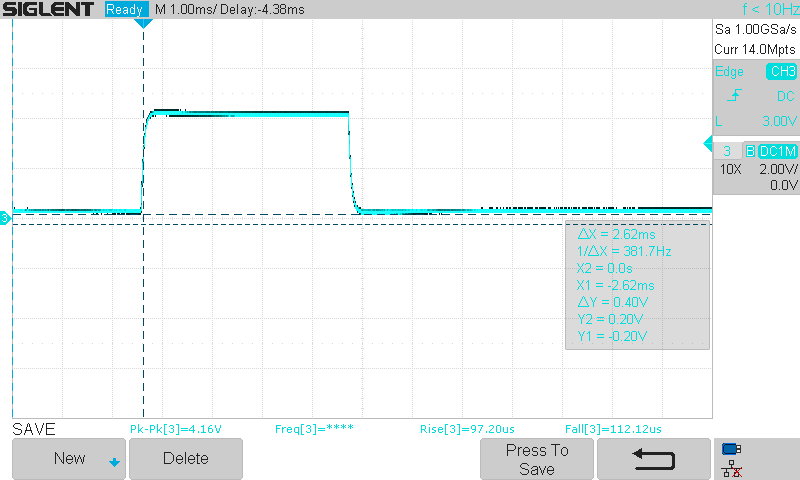
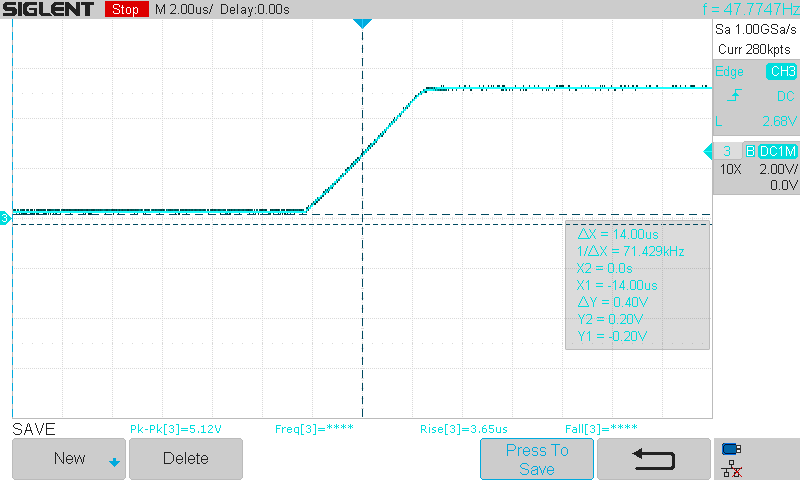

Notes

# 2022-08-23

* Soldered the board together
* It works! But I did find some minor errors.
* The voltage output varies as expected with light over a wide range

## Errors
* D1 footprint pin 1 assingment is backwards, this resulted in the diode being backwards
* The resulting current from the device is quite large resulting in the second amplifier stage being saturate in a lit room, I removed R7 to create a voltage follower and this alleviate the issues for now
* Placing the output on a scope it's clear there is a HF oscillation at 2.24mHz
** NOTE that the oscillation appears to be only on the 2nd stage output and not the first stage. Note that the second stage is now a voltage follower

# 2022-08-24

* Placed a 33pF capacitor across R8 and this stopped the oscillation
* I repopulated R7 with a 1K resistor
* There is some very very high frequency noise but pretty negligable it seems
* It works! I can definetley see an IRDA remote control signal at ~37KHz carrier
* It seems like if I want to use this in a bright room I'm going to have to turn the gains down
** Which is better - the TIA or the second stage?

# 2022-10-03

I've built up a bit of infrastructure around this TIA:
* Headphone amplifier to output the audio frequencies directly into headphones
* Listened to external light sources with a len assembly 3 miles away
* Built a simple audio light transmitter

I've noticed a faire bit of noise in the circuit. Hooking a scope up to the TP output I see a fairly complex oscillation between 30KHz and 97KHz. There is a different noise on the TIA output directly much smaller prior to the line driver amplifier.

**Noise on the TIA PCB 50 Ohm Output***

**Noise on the TIA Output directly**

I can see and hear the 120 Hz hum from my indoor (dim) lights that this noise is on top of.

# 2022-10-04

* I put the recommended bulk capacitors on the PYBE20-Q24-D5-T - No significant change but leaving them There
* I think it may have knocked a bit of the switching noise off
  * I defintely see a 32KHz DC/DC switching noise but it's near my scopes limit
  * It is seen on the preamp section op-amp bulk capacitors and in the TIA signal itself - It may be ground noise coming through the GND clip...?
  * Placing bulk capacitance on the preamp - no effect
* I added a 15pF capacitor to C2 to help bypass any HF signals past the 0 ohm or stabalize the POS input when in a higher impedance configuration
* I changed the Cf on the TIA (C4) from 3.3pF to 33pF for improved stability - No significant change - The nosie see is the same and defintely switching noise (likley on GND)
* I iterated a Cf across R8 and found that a 1nF completely kills the oscillation see - Tried ~200pF with good results but sign reduced from ~300mV to 60mV peak to peak.

I'm getting subjectively reduced noise!

I can clearly head music and tones from an online frequency generator through the transmitter (Although I don't think it's fully modulating the LED)

I listened to a few signals:

**iPhone FaceID Pulses**

The pulses are very clear (DC Coupled scope after the DC blocking capacitor) with a rise time of 92us (~3KHz)

**Optical Mouse LED/LASER**

This was much quicker of a signal and measured around 3.6us which is approximately (0.35/Tr) 100KHz bandwidth. I don't know what this signal looks linear.

# 2022-12-26

* I soldered a new TIA PCB together (Ver1.1) with just U1 TIA. I found that the TIA was stable at RF=10K and CF=6.6pF with the diode in photovoltaic mode (grounded) and the TIA V+ referenced to GND. This configuration did require U1 to operate with a split rail.
* I was wrong in the prior testing and it seemed that the U2 second stage was LPF'ing the 37KHz IRDA signals. I was clearly able to see the IRDA waveforms (still looked RC charged/discharged but that might have been the IR remote itself - More investigation needed.

# To-Do
* [DONE] Track down oscillation
* [DONE] Detect light pulses in the scope and observe the results
* Detemirne rough frequency response - even if simulated with updated values (37KHz carrier pulses looked pretty rounded) - This may inform a reduction in capacitances or resistances)
